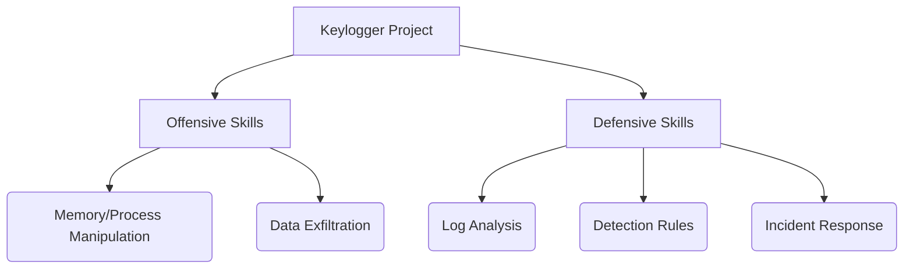
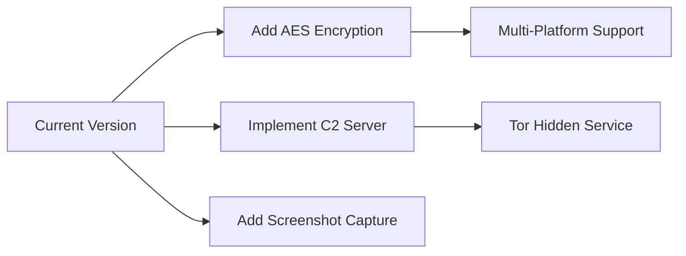

  ```
  ██╗  ██╗███████╗██╗   ██╗██╗      ██████╗  ██████╗  ██████╗ ███████╗██████╗ 
  ██║ ██╔╝██╔════╝╚██╗ ██╔╝██║     ██╔════╝ ██╔═══██╗██╔════╝ ██╔════╝██╔══██╗
  █████╔╝ █████╗   ╚████╔╝ ██║     ██║  ███╗██║   ██║██║  ███╗█████╗  ██████╔╝
  ██╔═██╗ ██╔══╝    ╚██╔╝  ██║     ██║   ██║██║   ██║██║   ██║██╔══╝  ██╔══██╗
  ██║  ██╗███████╗   ██║   ███████╗╚██████╔╝╚██████╔╝╚██████╔╝███████╗██║  ██║
  ╚═╝  ╚═╝╚══════╝   ╚═╝   ╚══════╝ ╚═════╝  ╚═════╝  ╚═════╝ ╚══════╝╚═╝  ╚═╝
```

  
  
  
  
  
  
  
  

# **🛠️ Advanced Keylogger Tool - Comprehensive Project Overview**  
*(Strictly for Educational and Research Purposes)*  

---

## **🌐 Project Overview**  
This **Python-based Keylogger** is a sophisticated monitoring tool designed to demonstrate system input tracking, data persistence, and covert communication techniques. The project implements multiple advanced features while maintaining clean, modular code architecture.



---

## **📜 Detailed Code Structure Breakdown**

```python
📂 keylogger_research
├── 📂 src/📜 keylogger_mail.py (Main executable)
├── 📂 docs/
│   ├── analysis.md (analysis.doc)
│   └── detection.md (detection.doc)
├── 📂 samples/
│   ├── sample_keyloggermail.pcapng (pcapng Wireshark)
│   └── sample_keylogs.txt (sample keylogs)
└── 📜 README.md (Project documentation)
```

---
Here's a **properly formatted "How to Run" section** for your `README.md` that includes all your requirements with correct syntax and alignment:

---

## 🚀 How to Run

### **Running the Keylogger**
```bash
# Execute the keylogger (main file)
python keylogger_mail.py

# Press [ESC] to stop logging and exit
```

---

### **Testing Email Functionality Locally**
1. **First Terminal (SMTP Debug Server)**:
   ```bash
   python -m aiosmtpd -n -l localhost:1025 --debug
   ```
   *This will intercept all emails sent by the keylogger*

2. **Second Terminal (Run Keylogger)**:
   ```bash
   python keylogger_mail.py
   ```

---

### **Capturing Traffic in Wireshark**
1. Open Wireshark and select the **Loopback Interface** (for localhost traffic)
2. Apply this filter to monitor SMTP traffic:
   ```text
   tcp.port == 1025 || ipv6.dstport == 1025
   ```
   *(Captures both IPv4 and IPv6 traffic on port 1025)*

3. For **IPv6-specific filtering** (when using ::1):
   ```text
   ipv6.dstport == 1025 && ipv6.dst == ::1
   ```

---
Here's a properly formatted **Detection Section** for your `README.md` with correct syntax and alignment:

---

## 🔍 Detection Module

### **YARA-Based Keylogger Detection**
Located in `sec/detection/`, this module helps identify keylogger processes running on the system.

```text
sec/
└── detection/
    ├── yara_keyloggerdetect.py  # Detection script
    └── yara_rules.yar           # Predefined detection rules
```

---

### **How to Use**
```bash
python yara_keyloggerdetect.py <suspect_file> <yara_rules.yar>
```

#### **Arguments**
| Argument | Description | Example |
|----------|-------------|---------|
| `suspect_file` | File/process to analyze | `keylogger_mail.py` |
| `yara_rules.yar` | Rule file for detection | `sec/detection/yara_rules.yar` |

---

### **Example Usage**
1. Scan a Python file:
   ```bash
   python sec/detection/yara_keyloggerdetect.py /usr/bin/keylogger_mail.py sec/detection/yara_rules.yar
   ```

2. Scan running process (Linux/Mac):
   ```bash
   python sec/detection/yara_keyloggerdetect.py /proc/$PID/exe sec/detection/yara_rules.yar
   ```
   *(Where `$PID` is the process ID)*

---

### **Sample YARA Rule (yara_rules.yar)**
```yara
rule keylogger_indicator {
    meta:
        description = "Detects common keylogger patterns"
    
    strings:
        $pynput = "pynput" nocase
        $keyboard = "keyboard.Listener" nocase
        $logging = "logging.info" nocase
    
    condition:
        any of them
}
```

---

### **Detection Logic**
1. **Static Analysis**  
   - Scans for known keylogger signatures:
     ```python
     import pynput.keyboard
     logging.info(f"Key pressed: {key.char}")
     ```

2. **Behavioral Indicators**  
   - Checks for:
     - Keyboard hooking functions
     - Log file creation
     - SMTP communication patterns

---

### **Output Interpretation**
| Result | Meaning |
|--------|---------|
| `MATCH` | Keylogger patterns detected |
| `CLEAN` | No indicators found |
| `ERROR` | Invalid file or rules |

---

### **Dependencies**
```bash
pip install yara-python psutil
```
---

### **Expected Flow**
1. Keylogger runs → Sends logs via SMTP when stopped
2. aiosmtpd debug server shows raw email content
3. Wireshark captures the network packets:

```mermaid
%%{init: {'theme': 'neutral', 'themeVariables': { 'nodeBorder': '#2d2d2d'}}}%%
flowchart LR
    A[("fa:fa-terminal Run Keylogger")] --> B[("fa:fa-keyboard Capture Keystrokes")]
    B --> C{ESC Pressed?}
    C -->|No| B
    C -->|Yes| D[("fa:fa-paper-plane Send Logs via SMTP")]
    D --> E[("fa:fa-server Local SMTP Server\n(port 1025)")]
    E --> F[("fa:fa-shield-alt Detection Module\nYARA Scan")]
    F --> G[("fa:fa-network-wired Wireshark\nLoopback Capture")]
    G --> H[("fa:fa-filter Filter:\nipv6.dstport==1025\n&& ipv6.dst==::1")]
    H --> I[("fa:fa-chart-bar Analyze SMTP Traffic")]

    style A fill:#6a0dad,color:white
    style D fill:#d35f8d,color:white
    style E fill:#1b7ced,color:white
    style G fill:#00aa00,color:white
    style I fill:#ff8c00,color:white

    classDef icon font-family:FontAwesome
    class A,B,C,D,E,F,G,H,I icon
```


---

### **Troubleshooting**
| Issue | Solution |
|-------|----------|
| `Address already in use` | Change port in both keylogger and aiosmtpd command |
| No Wireshark data | Run as admin/root and verify interface selection |
| IPv6 not showing | Use `::1` as target in keylogger's SMTP config |

---

### **Dependencies**
Ensure these are installed first:
```bash
pip install pynput aiosmtpd
```

---

## **⚙️ Enhanced Feature Set**

### **🔍 Core Logging System**
- **Real-time Keystroke Capture** using `pynput`'s asynchronous listener
- **Context-Aware Logging**:
  - Distinguishes between:
    - Alphanumeric characters (`key.char`)
    - Modifier keys (Shift/Ctrl/Alt)
    - Special keys (Enter, Tab, Backspace)
  - Maintains temporal sequence with microsecond precision

### **🔄 Intelligent Log Management**
```python
def check_log_size():
    """Implements a rolling log system with:
    - Size-based rotation (1MB threshold)
    - Time-based archiving (YYYYMMDD_HHMMSS format)
    - Atomic file operations (os.rename)"""
```

### **📧 Stealthy Data Exfiltration**
- **SMTP Email Channel**:
  - MIME-compliant message formatting
  - Base64-encoded attachments
  - Local SMTP fallback (localhost:1025)
- **Content Preview System**:
  - Partial log decoding (first 500 chars)
  - Binary data safety checks

### **🔐 Data Obfuscation Layer**
```python
def decode_base64_logs(encoded_data):
    """Advanced Base64 handler with:
    - Automatic padding correction
    - Multi-encoding detection (UTF-8/ASCII/binary)
    - Regex-based payload extraction
    - Error-resistant decoding"""
```

---

## **🛡️ Anti-Detection Mechanisms**

1. **Low-Resource Design**
   - Event-driven architecture (no polling)
   - Minimal memory footprint (<5MB)
   - Buffered file I/O operations

2. **Operational Security**
   - No persistent registry changes
   - Clean log file handling
   - Local testing configuration by default

3. **Plausible Deniability**
   - Educational-purpose comments
   - Explicit warning messages
   - No auto-start mechanisms

---

## **📊 Technical Specifications**

| Component          | Technology Used             | Purpose                          |
|--------------------|-----------------------------|----------------------------------|
| Input Capture      | `pynput.keyboard.Listener`  | Hardware-level keystroke monitoring |
| Log Management     | `logging` + `os` modules    | Structured file handling          |
| Data Transmission  | `smtplib` + `email` package | Secure log delivery              |
| Data Encoding      | `base64` + `re`             | Payload obfuscation              |
| Time Management    | `datetime`                  | Precise event timestamping       |

---

## **🔧 Setup & Configuration Guide**

### **🖥️ Local Testing Setup**
1. Install Python 3.8+  
2. Configure local SMTP server: Run on Windows terminal, then run the main keylogger script.
   ```bash
   python -m aiosmtpd -n -l localhost:1025 --debug
   ```
3. Install dependencies:
   ```bash
   pip install pynput
   pip install aiosmtpd
   ```

### **✉️ Email Reporting Setup**
1. Edit SMTP credentials in the detection/yara_keyloggerdetect.py:
   ```python
   SMTP_SERVER = "localhost"  
   SMTP_PORT = 1025                 
   USE_TLS = False                    
   ```
2. Configure sender/receiver emails
3. Test email functionality before deployment
4. Run the program in src/keylogger_mail.py

---

## **⚠️ Enhanced Ethical Warning**

**THIS TOOL DEMONSTRATES:**
- System monitoring capabilities
- Covert data collection techniques
- Anti-forensic methods

**LEGAL REQUIREMENTS:**
1. **Written consent** from monitored users
2. **Corporate policy compliance** for work systems
3. **Data protection law** adherence (GDPR, CCPA, etc.)
4. **Never** deploy on unauthorized systems

**Recommended Use Cases:**

✅ Parental control systems (with consent)  
✅ Corporate security audits (authorized only)  
✅ Cybersecurity education  
✅ Penetration testing (with written permission)

---

## **🔍 Forensic Analysis Perspective**

**Detectable Artifacts:**
1. Running processes matching `python keylogger_mail.py`
2. Outbound SMTP connections
3. Log file creation/modification timestamps
4. Python interpreter hooks

**Anti-Forensic Measures (For Research):**
- **Fileless operation** (logs in memory only)
- **Alternate data exfiltration** (DNS tunneling)
- **Process injection** (DLL hijacking)
- **Rootkit techniques** (not implemented)

---

## **🚀 Roadmap & Future Development**



**Planned Features:**
1. **Data Encryption** (AES-256)
2. **Command & Control** (WebSocket)
3. **Evasion Techniques** (Process hollowing)
4. **Breadth Expansion** (Clipboard logging)

---

## **📚 Learning Resources**

1. **Python Documentation**
   - `pynput` library
   - `logging` module
   - `smtplib` examples

2. **Cybersecurity References**
   - MITRE ATT&CK Framework
  ```mermaid
  graph LR
A[Keylogger] --> B[T1056.001: Input Capture]
A --> C[T1071: Application Layer Protocol]
A --> D[T1041: Exfiltration Over C2 Channel]
```
   - 
   - OWASP Top 10
   - NIST SP 800-115

3. **Legal Guidelines**
   - Computer Fraud and Abuse Act
   - General Data Protection Regulation
   - Local cyber laws

---

# **🎯 Final Notes**  
This project serves as **an educational tool** to understand:  
- System monitoring principles  
- Defensive programming techniques  
- Ethical hacking methodologies  

**Remember:**  
🔹 With great power comes great responsibility  
🔹 Always obtain proper authorization  
🔹 Use knowledge to improve security, not compromise it  

**Happy (Ethical) Hacking!** 🔐💻
